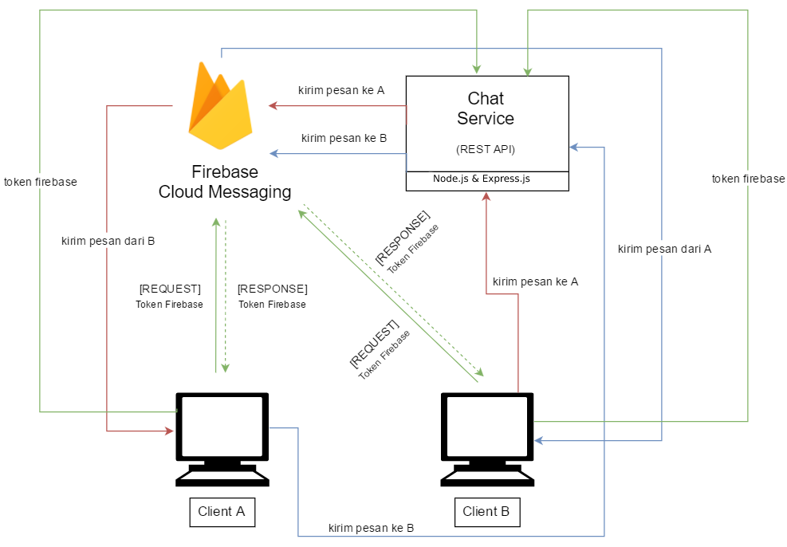

# Tugas 3 IF3110 Pengembangan Aplikasi Berbasis Web

Melakukan upgrade Website ojek online sederhana pada Tugas 2 dengan mengaplikasikan ***cloud service* (Firebase Cloud Messaging) dan *framework* MEAN stack**.

## Tujuan Pembuatan Tugas

Diharapkan dengan tugas ini Anda dapat mengerti:
* MEAN stack (Mongo, Express, Angular, dan Node)
* *Cloud service* Firebase Cloud Messaging (FCM) dan kegunaannya.
* Web security terkait access token dan HTTP Headers.

### Arsitektur Umum
Tugas 3 ini terdiri dari komponen Tugas 2 dan tambahan yang harus dibuat:
* `Pemanfaatan FCM`: Pengiriman pesan dari pelanggan ke driver atau sebaliknya dengan menggunakan layanan Firebase Cloud Messaging (FCM).
* `Implementasi MEAN stack`: Membuat REST service untuk keperluan layanan chat memanfaatkan FCM menggunakan Node, Express dan Mongo, serta membuat halaman chat yang menggunakan Angular.

### Rincian REST Service
1. REST service untuk keperluan chatting **wajib** diimplementasikan dengan **Node dan Express**.
2. REST service menangani hal-hal sebagai berikut.
    * Memberikan daftar driver yang sesuai requirement (sesuai deskripsi tugas nomor 7)
    * Menyimpan identitas (token FCM) dari masing-masing pengguna yang sedang online
    * Menerima *request* dari user A untuk chat ke user B, lalu membuat *request* ke FCM untuk pengiriman pesan ke token FCM user B.
    * Menyimpan ke basis data history chat dari seorang pemesan dan seorang driver. Misalkan A pernah memesan driver B. Jika suatu saat A akan memesan lagi ke driver B, maka kotak chat menampilkan chat yang dilakukan pada pemesanan sebelumnya.
3. Untuk penyimpanan history chat, basis data yang digunakan **wajib Mongo**. Anda tidak diperkenankan menggunakan basis data yang lain, termasuk layanan Firebase Database.

### Halaman Tambahan
1. Halaman Order pada pengguna non driver, terdapat tambahan chat driver pada tahap ketiga
2. Halaman Order pada pengguna driver

### Rincian Arsitektur Aplikasi Chat

Proses untuk komunikasi antar client adalah sebagai berikut:
1. Ketika client dijalankan, client akan meminta token (token yang berbeda dengan token untuk authentication dari Identity Service) dari FCM.
2. FCM mengirimkan token ke client.
3. Setelah token diterima, client akan mengirim token serta identitas dari client (nama/email) ke chat server. Identitas client digunakan untuk mengidentifikasi kepemilikan token.
4. Untuk mengirim pesan kepada client lain, client pertama mengirimkan pesan yang berisi identitas pengirim, identitas tujuan, dan isi pesan ke chat server.
5. Chat server kemudian akan mencari token yang terkait dengan identitas tujuan.
6. Chat server lalu mengirim request ke FCM untuk mengirimkan pesan kepada client dangan token yang terkait.
7. FCM mengirimkan pesan kepada tujuan.

### Asumsi yang Digunakan
1. Pada tugas ini, diasumsikan kedua client sedang aktif. Aplikasi hanya akan dijalankan pada localhost, sehingga memerlukan 2 browser yang berbeda untuk mensimulasikan client yang berbeda. Aplikasi berjalan pada localhost karena browser mensyaratkan sumber aplikasi harus aman untuk operasi-operasi yang digunakan pada aplikasi ini. Localhost termasuk lokasi yang diperbolehkan oleh browser.
2. Kedua browser tersebut harus dalam keadaan aktif dan terfokus, serta tidak terminimize. Hal ini karena cara kerja service worker, yang hanya dapat memberikan notifikasi, dan tidak dapat melakukan manipulasi halaman apabila web browser tidak sedang terfokus ketika pesan datang.
Selain itu, seorang pengguna hanya dapat chatting dengan 1 pengguna lain dalam 1 waktu, sehingga hanya 1 kotak chat yang ditampilkan.
3. Driver hanya dapat menerima satu order dari satu user pada satu waktu.

### Skenario Chatting
Skenario penggunaan aplikasi adalah sebagai berikut.
Misal pengguna A adalah non driver, dan pengguna B adalah driver.
1. A dan B login untuk masuk ke aplikasi.
2. B melakukan finding order pada halaman Order. A memasuki halaman Order.
3. A melakukan order dan memilih driver yang sedang online dan tersedia (driver B).
4. Kotak chat akan muncul di halaman Chat Driver pada layar A. Kotak chat juga akan muncul pada halaman Order pada B.
5. A mengetikkan pesan, dan menekan tombol kirim.
6. Pesan dikirim ke B melalui chat server dan FCM.
7. Ketika pesan sudah diterima di B, kotak chat pada layar B akan muncul.
8. B dapat membalas chat dari A.
9. Apabila A sudah melakukan submit rating maka chatbox pada B akan hilang dan kembali menampilkan halaman finding order.

### Skenario Umum Program
Skenario program selain chat, pada umumnya sama seperti tugas 2. Akan tetapi, metode pengecekan token pada identity service sedikit berbeda.

Identity Service harus mengecek:
1. Apakah access token ini sudah kadaluarsa?
2. Apakah access token ini digunakan pada browser yang berbeda?
3. Apakah access token ini digunakan dengan koneksi internet yang berbeda?

Jika jawaban salah satu pertanyaan tersebut adalah "ya", maka identity service akan memberikan respon error dan detail errornya.

### Mekanisme pembuatan token
Token anda harus mempunyai informasi terkait browser (user agent) dan IP address dari pengguna. Identity service harus dapat mengekstrak informasi tersebut. Sebagai contoh, anda dapat melakukan (tidak harus) konstruksi token dengan `format:some_random_string#user_agent#ip_address`. Jika pada tugas 2 token anda adalah abcdefgh Maka pada tugas 3 token anda adalah `abcdefgh#Mozilla/5.0 (Windows NT 6.3; WOW64) AppleWebKit/537.36 (KHTML, like Gecko) Chrome/46.0.2490.86 Safari/537.36#167.205.22.104`.

Token tidak perlu dienkripsi-dekripsi (for simplicity)

Perlu diperhatikan bahwa chat yang dikirim oleh user yang sedang login berada disisi sebelah kanan dan lawan chatnya lain di sisi sebelah kirim. Isi chat jga harus ditampilkan sesuai urutan waktu diterima (paling atas adalah chat paling lama dan makin ke bawah chat makin baru).

### Dosen

Yudistira Dwi Wardhana | Riza Satria Perdana | Muhammad Zuhri Catur Candra
